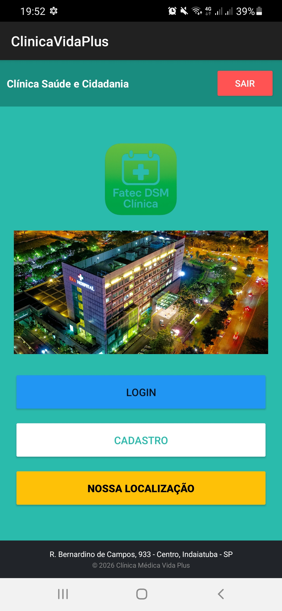
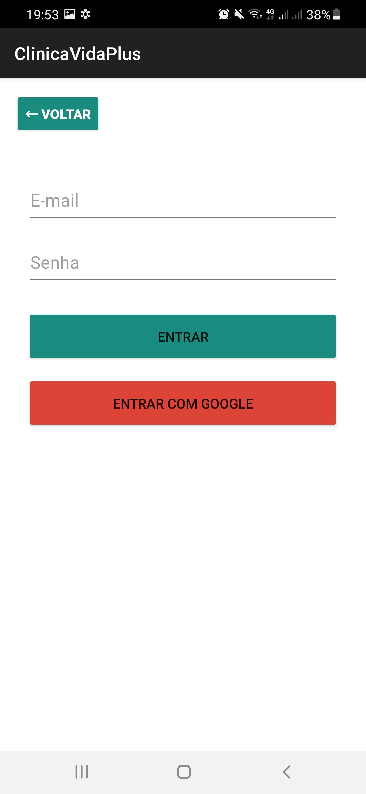
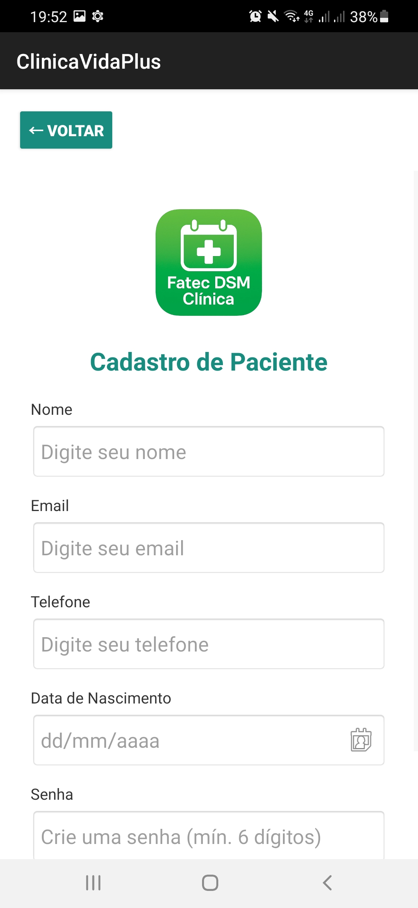
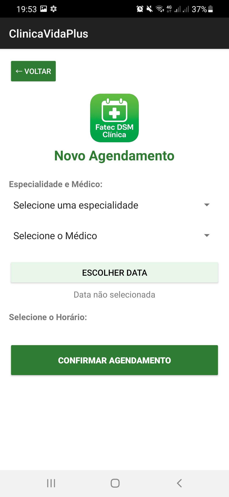
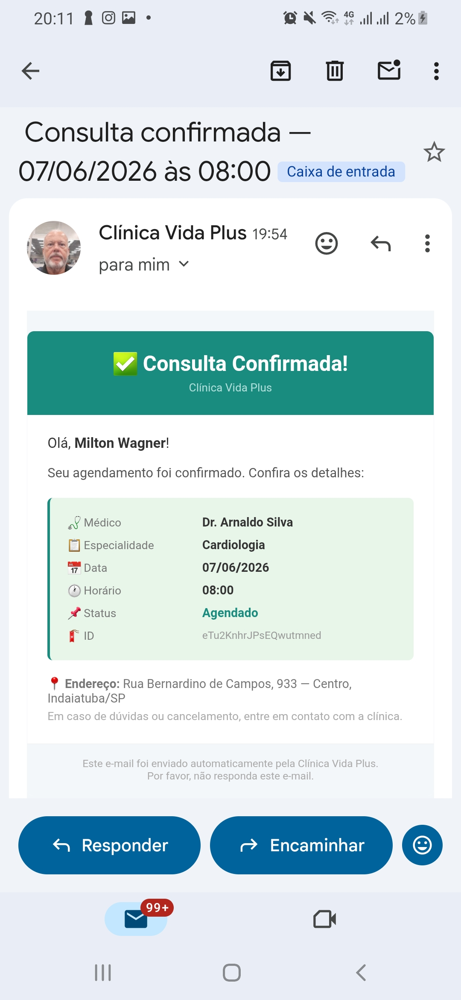
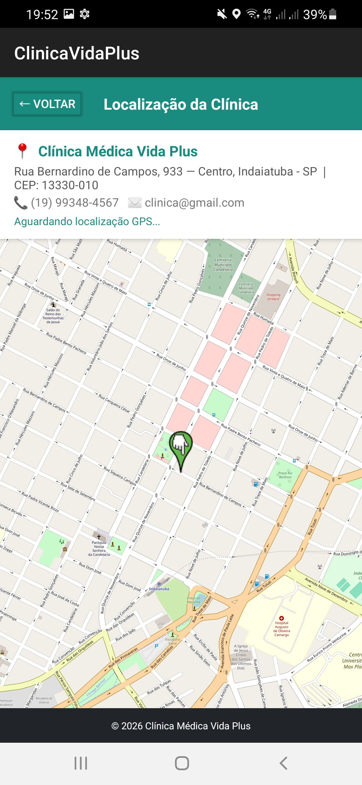

#  Clínica Médica Vida Plus — Aplicativo Android

> Aplicativo mobile para gestão de consultas médicas, desenvolvido em Java com Android Studio.
>
> Curso: Desenvolvimento de Software Multiplataforma — 4º Semestre
> Aluno: Milton Wagner Filho
> Professora: Simone Mendes
> Ano: 1/2026

---

## Sumário

- [Sobre o Projeto](#sobre-o-projeto)
- [Funcionalidades](#funcionalidades)
- [Tecnologias Utilizadas](#tecnologias-utilizadas)
- [Arquitetura](#arquitetura)
- [Estrutura de Arquivos](#estrutura-de-arquivos)
- [Pré-requisitos](#pré-requisitos)
- [Como Executar](#como-executar)
- [Telas do Aplicativo](#telas-do-aplicativo)
- [Conceitos Implementados](#conceitos-implementados)
- [Referências](#referências)

---

## Sobre o Projeto

**Clínica Médica Vida Plus** é um aplicativo Android que permite ao paciente realizar cadastro, autenticação segura, agendamento de consultas com médicos especializados, visualização do histórico de atendimentos e localização da clínica em mapa interativo — tudo a partir de um único app.

O projeto foi desenvolvido como trabalho acadêmico do curso de Desenvolvimento de Software Multiplataforma, aplicando na prática os quatro conceitos principais vistos em aula: banco de dados local (ROOM), banco de dados remoto (Firebase Firestore), autenticação com Google e geolocalização com OpenStreetMap.

---

## Funcionalidades

### Implementadas

| Funcionalidade | Descrição |
|---|---|
| Cadastro de Paciente | Nome, e-mail, telefone, data de nascimento e senha |
| Login com E-mail/Senha | Autenticação via Firebase Auth |
| Login com Google | Google Sign-In integrado ao Firebase |
| Agendamento de Consultas | Seleção de médico, especialidade, data e horário |
| Verificação de Disponibilidade | Horários ocupados exibidos em cinza em tempo real |
| Confirmação de Agendamento | Resumo da consulta salvo no Firestore |
| E-mail de Confirmação | Envio automático ao paciente após o agendamento |
| Armazenamento Local | Dados do paciente salvos localmente com ROOM |
| Localização da Clínica | Mapa interativo com OpenStreetMap + GPS em tempo real |

### Funcionalidades Futuras

- Listagem e cancelamento de agendamentos pelo paciente
- Perfil editável (nome, telefone, data de nascimento)
- Recuperação de senha por e-mail
- Notificações push 24h antes da consulta (Firebase Cloud Messaging)
- Histórico médico completo com filtros
- Avaliação de consultas com estrelas e comentários
- Painel administrativo web para a clínica

---

## Tecnologias Utilizadas

| Categoria | Tecnologia | Finalidade |
|---|---|---|
| IDE | Android Studio | Desenvolvimento do app Android |
| Linguagem | Java | Lógica do aplicativo |
| Banco Local | ROOM (SQLite) | Armazenamento offline dos dados do paciente |
| Banco Remoto | Firebase Firestore | Armazenamento de pacientes e agendamentos na nuvem |
| Autenticação | Firebase Authentication | Login com e-mail/senha e Google |
| Login Social | Google Sign-In | Autenticação simplificada com conta Google |
| Geolocalização | FusedLocationProviderClient | Obtenção das coordenadas GPS do usuário |
| Mapa | OpenStreetMap + osmdroid | Exibição do mapa interativo sem API Key |
| E-mail | JavaMail (SMTP Gmail) | Confirmação de agendamento por e-mail |
| Backend Serverless | Firebase Cloud Functions | Gatilho de e-mail via Firestore |
| Versionamento | Git / GitHub | Controle de versão |

---

## Arquitetura

O aplicativo segue arquitetura de camadas com padrão Repository:

```
┌─────────────────────────────────────────────┐
│           Camada de Apresentação            │
│  (Activities + Layouts XML)                 │
│  IndexActivity, LoginActivity,              │
│  MainActivity, ConsultasActivity,           │
│  ListaConsultasActivity, EnderecoActivity   │
└──────────────────┬──────────────────────────┘
                   │
┌──────────────────▼──────────────────────────┐
│           Camada de Lógica                  │
│  PacienteRepository — coordena ROOM e       │
│  Firebase · EmailSender (AsyncTask SMTP)    │
└──────────┬───────────────────┬──────────────┘
           │                   │
┌──────────▼──────┐   ┌────────▼──────────────┐
│  Banco LOCAL    │   │  Banco REMOTO          │
│  ROOM (SQLite)  │   │  Firebase Firestore    │
│  clinica_db     │   │  /pacientes            │
│  tabela:        │   │  /agendamentos         │
│  pacientes      │   └───────────────────────┘
└─────────────────┘
```

---

## Estrutura de Arquivos

```
clinicavidaplus/
├── assets/
│   ├── tela-home.png
│   ├── tela-login.png
│   ├── tela-cadastro.png
│   ├── tela-agendamento.png
│   ├── tela-email.png
│   └── tela-localizacao.png
├── app/
│   ├── src/main/
│   │   ├── java/com/example/clinicavidaplus/
│   │   │   ├── IndexActivity.java              # Tela inicial
│   │   │   ├── MainActivity.java               # Cadastro de paciente
│   │   │   ├── LoginActivity.java              # Login e-mail + Google
│   │   │   ├── ConsultasActivity.java          # Agendamento de consultas
│   │   │   ├── ListaConsultasActivity.java     # Confirmação do agendamento
│   │   │   ├── EnderecoActivity.java           # Mapa com localização da clínica
│   │   │   ├── EmailSender.java                # Envio de e-mail SMTP
│   │   │   ├── Paciente.java                   # Entity ROOM + modelo Firebase
│   │   │   ├── PacienteDao.java                # DAO — operações no banco local
│   │   │   ├── AppDatabase.java                # Configuração do banco ROOM
│   │   │   └── PacienteRepository.java         # Repository — ROOM + Firebase
│   │   ├── res/layout/
│   │   │   ├── activity_index.xml
│   │   │   ├── activity_main.xml
│   │   │   ├── activity_login.xml
│   │   │   ├── activity_consultas.xml
│   │   │   ├── activity_lista_consultas.xml
│   │   │   └── activity_endereco.xml
│   │   └── AndroidManifest.xml
│   ├── build.gradle.kts
│   └── google-services.json
├── build.gradle.kts
└── README.md
```

---

## Pré-requisitos

- Android Studio Hedgehog ou superior
- JDK 11 ou superior
- Conta no Firebase com projeto configurado
- Dispositivo físico ou emulador com Android 7.0 (API 24) ou superior

---

## Como Executar

1. Clone o repositório
2. Abra o projeto no Android Studio
3. Aguarde o Gradle sincronizar as dependências
4. Conecte um dispositivo físico (com depuração USB ativada) ou inicie um emulador
5. Clique em **Run ▶**

---

## Telas do Aplicativo

| Tela | Activity | Descrição |
|---|---|---|
| Inicial | `IndexActivity` | Menu com Login, Cadastro e Localização |
| Cadastro | `MainActivity` | Formulário de registro do paciente |
| Login | `LoginActivity` | Autenticação e-mail/senha + Google |
| Agendamento | `ConsultasActivity` | Seleção de médico, data e horário |
| Confirmação | `ListaConsultasActivity` | Resumo do agendamento realizado |
| Localização | `EnderecoActivity` | Mapa OSM com pin da clínica e GPS do usuário |

<p align="center">
  
  
  
</p>
<p align="center">
  
  
  
</p>

---

## Conceitos Implementados

### 1. Conexão Local — ROOM
Biblioteca Android de persistência local baseada em SQLite. Ao cadastrar, os dados do paciente são salvos no banco local `clinica_db` (tabela `pacientes`) via `PacienteRepository`, permitindo acesso offline.

### 2. Conexão Remota — Firebase Firestore
Banco de dados NoSQL em nuvem. Agendamentos e dados de pacientes são sincronizados remotamente em tempo real, permitindo que múltiplos dispositivos visualizem horários ocupados instantaneamente.

### 3. Autenticação com Google
Implementada via Firebase Authentication com Google Sign-In. O paciente pode criar conta e fazer login usando sua conta Google, sem precisar digitar senha.

### 4. Geolocalização
Utiliza `FusedLocationProviderClient` para obter as coordenadas GPS do usuário e a biblioteca `osmdroid` para renderizar o mapa OpenStreetMap com um marcador fixo na clínica e outro marcador dinâmico na posição atual do usuário.

---

## Referências

- Firebase Documentation. Google LLC. Disponível em: https://firebase.google.com/docs
- Android Developers — ROOM. Disponível em: https://developer.android.com/training/data-storage/room
- osmdroid — OpenStreetMap Tools for Android. Disponível em: https://github.com/osmdroid/osmdroid
- Google Sign-In for Android. Disponível em: https://developers.google.com/identity/sign-in/android
- Android Developers Documentation. Disponível em: https://developer.android.com/docs

---

> **Clínica Médica Vida Plus** — Rua Bernardino de Campos, 933, Centro, Indaiatuba – SP
> Telefone: (19) 99447.4377 | E-mail: milton.wagner2013@gmail.com
> © 2026 Clínica Médica Vida Plus
